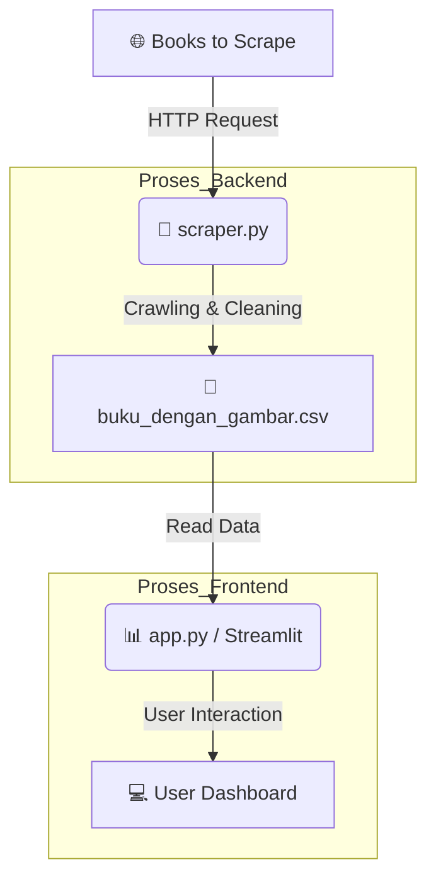

# 📚 Madiun Digital Library

Proyek ini adalah aplikasi **Dashboard Analisis Pasar Buku** yang dibangun menggunakan Python. Aplikasi ini mengambil data secara otomatis (Scraping) dari situs buku, membersihkannya, dan menampilkannya dalam bentuk galeri interaktif.

## 🎯 Fitur Utama
- **Automated Web Scraping:** Robot pencari data otomatis (Judul, Harga, Stok, Gambar).
- **Deep Crawling:** Masuk ke halaman detail untuk mengambil sinopsis dan stok real.
- **Data Cleaning:** Membersihkan format mata uang (£) dan stok menggunakan Regex.
- **Interactive Dashboard:** Tampilan web modern (Netflix Style) menggunakan **Streamlit**.

## 🛠️ Teknologi
- Python 3.10
- BeautifulSoup4 (Scraping)
- Pandas (Data Processing)
- Streamlit (Web App Framework)
- Matplotlib & Seaborn (Visualisasi)

## ⚙️ Alur Kerja Sistem (Architecture)
Berikut adalah diagram bagaimana data diproses dari website target hingga tampil di dashboard pengguna:


## 🚀 Cara Menjalankan
1. Install library:
   ```bash
   pip install -r requirements.txt
